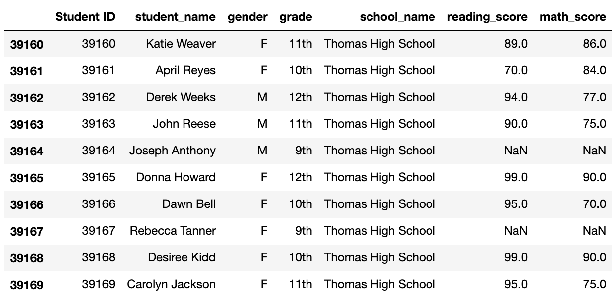
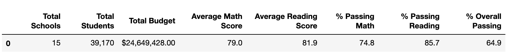
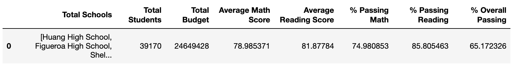
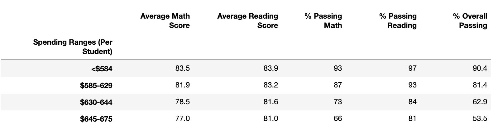
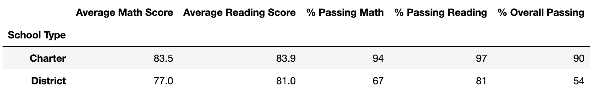

# School_District_Analysis
 # To get the passing percentages, we need to:
 # 1. Determine what is the passing grade.
 # 2. Get the number of students who passed math and reading.
 # 3. Get the students who passed math and passed reading

# Overview of the school district analysis: Explain the purpose of this analysis.
Maria, a data scientist in a city school, is helping schools replace the dishonest score with NaN using multiple information based on student math and reading scores in  Thomas High School. This analysis provides the influence to assist the school board and superintendent in making decisions in the school budget and priorities.

# Results: Using bulleted lists and images of DataFrames as support, address the following questions.
This analysis first uses 'NaN' to replace all ninth-grade students of Thomas High School to eliminate the effect of dishonest students on the overall school analysis.

* How is the district summary affected?
_After_

_before_

- Total overall passing percentage fall to 64.9%.
- The percentage of passing reading decrease from 85.8% to 85.7%.
- The percentage of passing math decrease from 74.98% to 84.8%.

* How is the school summary affected?
 
 
School rank of Thomas High School is unchanged, it still stand in the second within all the school. 

* How does replacing the ninth graders’ math and reading scores affect Thomas High School’s performance relative to the other schools?

## How does replacing the ninth-grade scores affect the following:
* Math and reading scores by grade
* Scores by school spending

* Scores by school size

Charter type school always provide better performance than the District type school, especially in overall percentage. District school has a pretty low (54%) compare to the Charter (90%).

* Scores by school type

## Summary: Summarize four changes in the updated school district analysis after reading and math scores for the ninth grade at Thomas High School have been replaced with NaNs.
It is difficult to insight the dishonest behaviour if the school board does not know the full extent of the file. And there is tiny effect of the school passing percentage and rank result. 
