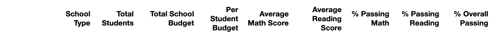

# School_District_Analysis
# Overview 
Maria, a data scientist in a city school, is helping schools replace the dishonest score with NaN using multiple information based on student math and reading scores in  Thomas High School. This analysis provides the influence to assist the school board and superintendent in making decisions in the school budget and priorities.

# Results
This analysis first uses 'NaN' to replace all ninth-grade students of Thomas High School to eliminate the effect of dishonest students on the overall school analysis.

* The effect of district summary 

_After_

_before_

1. Total overall passing percentage fall to 64.9%.
2. The percentage of passing reading decrease from 85.8% to 85.7%.
3. The percentage of passing math decrease from 74.98% to 84.8%.

* The effect of school summary 
 
 
 
School rank of Thomas High School is unchanged, it still stand in the second within all the school. 

## How does replacing the ninth-grade scores affect the following:
* Scores by school spending

This image describes that the increase of overall percentage will not affect the school spending increase. The school spending between $645-675 has the lowest overall rate at 53.5%.

* Scores by school size

The small and medium schools have very high passing math percentages (94%). However, a large type of school only has a 70% passing math percentage. Also, the large school has a low passing percentage in reading(70%), resulting in a low overall passing rate (58%). 

* Scores by school type

Charter-type schools always provide better performance than the District type school, especially in overall percentage. However, district schools have a pretty low (54%) compared to the Charter (90%).

## Summary
It is difficult to insight the dishonest behaviour if the school board does not know the full extent of the file. And there is little effect on the school passing percentage and rank result. 
